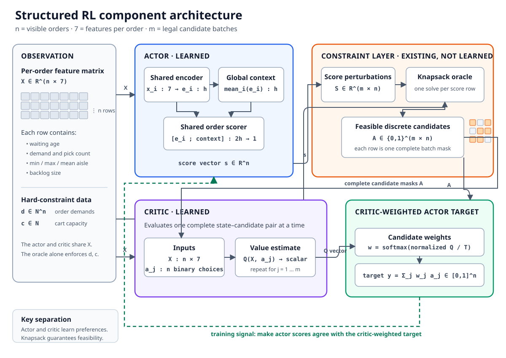
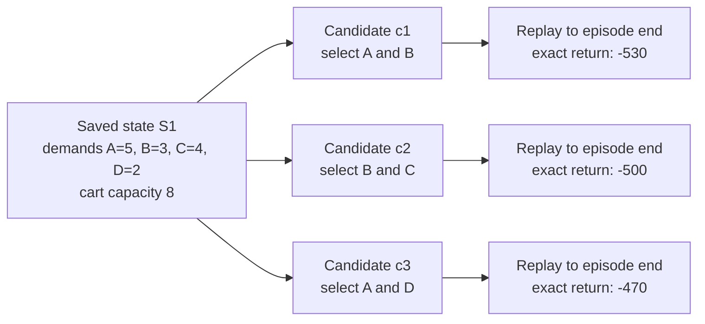
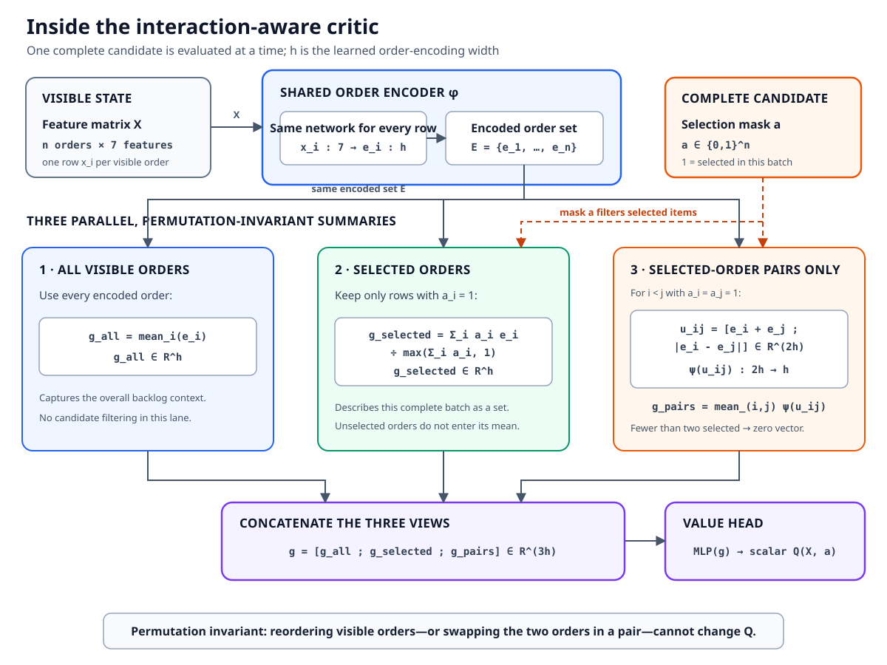

# Structured RL for order batching — a beginner's guide

This guide explains what the learning system is supposed to do, how its parts
work together, and what the experiments have taught us. It assumes no prior
knowledge of reinforcement learning.

For equations and complete result tables, see
[objective_derived_reward_methodology.md](objective_derived_reward_methodology.md)
and
[structured_critic_counterfactual_audit.md](structured_critic_counterfactual_audit.md).

## The job we want to automate

Orders arrive at a warehouse. A picker can carry only a limited amount at
once. Whenever the picker is ready, we must choose which waiting orders belong
in the next tour.

That chosen group is called a **batch**.

The learning system answers one question:

> Which of the currently waiting orders should go into the next batch?

It does not decide whether to wait, which picker to use, or which routing
algorithm to run. Waiting is disabled in this study. The existing simulator
and routing code execute every chosen batch.

## Why this is harder than choosing one action

The decision is not “pick A or B.” It is “pick any group that fits on the
cart.” With many waiting orders, there can be an enormous number of possible
groups.

The cart also imposes a hard rule: the total demand of the chosen orders must
fit within its capacity. We do not want a neural network to learn this rule by
making mistakes.

The system therefore has three parts.

## The three parts: proposer, rule checker, and coach

### 1. The actor is the proposer

The **actor** gives every waiting order a score. A high score means “this order
looks useful for the next batch.”

The actor sees simple information such as:

- how long the order has waited;
- how much cart capacity it needs;
- how many pick locations it contains;
- where those locations are in the warehouse;
- how many other orders are waiting.

The actor does not directly produce a batch.

### 2. The knapsack solver is the rule checker

The existing knapsack solver takes the actor's scores and finds the
highest-scoring group that fits on the cart. It always returns a legal batch.

```text
waiting orders -> actor scores -> knapsack solver -> valid batch
```

For example, suppose the cart capacity is 8:

| Order | Demand | Actor score |
|---|---:|---:|
| A | 5 | 6 |
| B | 3 | 4 |
| C | 4 | 5 |

A and B exactly fill the cart and have a combined score of 10. A and C do not
fit. B and C fit but score only 9. The solver therefore chooses A and B.

This combination of learned scores and a hard optimization rule is why the
approach is called **structured reinforcement learning**.

### 3. The critic is the coach

The **critic** tries to predict how good a proposed batch will be in the long
run. It must consider more than the next tour. A batch also changes which
orders remain for later tours.

During training, the actor proposes several slightly different batches. The
critic compares them and tells the actor which direction looks better.

The critic assigns an expected future value to each candidate. We then compare
each value with the values of the other candidates available at that same
decision. This relative difference is called a **candidate advantage**:

- positive advantage: the candidate looks better than the local average;
- negative advantage: it looks worse than the local average;
- zero advantage: it looks average for this particular decision.

This is deliberately a local comparison. A critic may produce values on very
different numerical scales in an easy state and a difficult state. We subtract
the candidate mean and divide by their spread before turning the advantages
into weights. This asks “which candidate is better here?” without letting an
arbitrary value scale make one state dominate training.

A useful mental model is:

- actor: “Here are some batches I could choose.”
- rule checker: “These are legal.”
- critic: “This one should lead to the best overall result.”

The same architecture can be viewed as layers of data. Let `n` be the number
of waiting orders and `m` the number of candidate batches:

| Layer | What goes in | Shape | What comes out | Shape |
|---|---|---:|---|---:|
| Order description | One row per order: waiting age, demand, pick count, minimum/maximum/mean aisle position, and backlog size | `n × 7` | The critic's per-order view of the current state | `n × 7` |
| Actor | The state rows, plus their shared overall context | `n × 7` | One preference score per order | `n` |
| Candidate construction | The actor scores, several perturbed copies, each order's demand, and cart capacity | `m × n` scores, `n` demands, one capacity | The knapsack solver's legal complete batches, stored as yes/no masks over all waiting orders | `m × n` |
| Critic | The complete state and one complete candidate mask; the interaction-aware critic also summarizes selected-order pairs | `n × 7` and `n` | One predicted long-term value, `Q(state, candidate)` | one scalar |

The critic is therefore not scoring orders independently. It sees both the
whole waiting state and the whole proposed batch, and returns one number for
that state–batch combination. Repeating this for all `m` candidates gives the
values the actor uses as training advice.



### Return-to-go: the result from here onward

After a complete episode, every chosen batch can receive a
**return-to-go** label. This is simply the sum of all rewards from that decision
until the episode ends.

Imagine pausing the warehouse immediately after choosing a batch and collecting
the rest of the episode's cost on one receipt. That receipt is the
return-to-go. With `gamma=1`, later costs are not discounted or made less
important.

Return-to-go is a more complete label than only looking at the cost of the next
tour. But it describes only the batch that was actually chosen. It does not
tell us what the receipt would have looked like after a different batch.

## What are we trying to improve?

The main measurement is **flow time**:

```text
flow time = completion time - arrival time
```

If an order arrives at time 10 and finishes at time 25, its flow time is 15.
Time spent waiting for a batch counts. Time spent being picked also counts.

The basic reward minimizes the sum of all order flow times. The environment
charges the agent for unfinished work as simulated time passes. Adding all
step rewards over a completed episode gives exactly the negative final flow
time objective. There are no arbitrary bonuses for “nice-looking” actions.

The study also tested a stronger penalty for very slow orders. This is called a
**convex objective** because the penalty grows faster as flow time grows—the
cost curve bends upward instead of remaining a straight line. The tested
setting squares each order's flow time. For example:

- a flow time of 10 contributes 100;
- a flow time of 20 contributes 400.

Doubling flow time from 10 to 20 therefore multiplies its cost by four, not two.
An additional minute hurts more when an order is already very late. This puts
more pressure on long delays. It is still not exactly the same as optimizing
the worst order or the 95th percentile.

The reward is mathematically correct only when:

- an order counts from its real arrival time;
- the episode runs until every relevant order is finished;
- future rewards are not discounted (`gamma=1`).

The implementation checks that the accumulated reward equals the final
objective after every episode.

## What worked initially?

For ordinary total flow time, the learned batching policy performed well. On
the 16 test instances it reduced average flow time by about 9.1% compared with
the strongest corrected no-wait heuristic baseline.

This was not a universal improvement. Its longest flow times and travel
distance were worse. The result means that the actor learned a useful batching
rule for average flow time, not that it solved every warehouse objective.

## What went wrong when slow orders received a stronger penalty?

The stronger reward did not produce a better policy for that objective. We
first checked the obvious possibilities:

- The reward calculation was correct.
- The actor generated alternative legal batches that really were better.
- The failure was therefore somewhere between evaluating those alternatives
  and teaching the actor to prefer them.

The critic became the main suspect.

## Why the critic had too little information

At first, the critic learned only from batches that the actor actually chose.
It could learn:

> “We chose batch A, and the rest of the episode produced this result.”

But it was not told:

> “At that same moment, batch B would have been better and batch C would have
> been worse.”

Knowing the result of one choice does not automatically reveal what the other
choices would have done.

We therefore performed a **counterfactual audit**. “Counterfactual” means
“what would have happened if we had chosen differently?” “Audit” means that we
check the critic's predictions against those alternative outcomes without
quietly changing the policy or its test.

For a saved decision, we replayed the simulator several times. Each replay
started from the same state, selected a different candidate batch, and then ran
to completion. The final result of each replay is an exact counterfactual
label. We can then ask whether the critic predicted the candidates in the
correct order and how costly its preferred candidate really was.

Here is one small **illustrative** state. The names and numbers are invented;
they are not reported experiment results.



Those three branches become three rows in the offline dataset:

| Saved state | Candidate | Selected orders now | Exact complete replay outcome | Exact return-to-go |
|---|---|---|---|---:|
| `S1`: A=5, B=3, C=4, D=2; cart capacity 8 | `c1` | A and B | Episode finishes with squared-flow cost 530 | `-530` |
| Same `S1` | `c2` | B and C | Episode finishes with squared-flow cost 500 | `-500` |
| Same `S1` | `c3` | A and D | Episode finishes with squared-flow cost 470 | `-470` |

Because reward is the negative cost, a less negative return is better. The
important point is that all three exact labels start from the same state and
differ only in the first batch choice.

After fitting, we can compare critic predictions with those exact labels. This
worked example is also **illustrative** and deliberately gives the critic a
ranking mistake. Candidate advantage is the prediction minus the candidate
mean, divided by the candidates' spread:

| Candidate | Predicted `Q` | Candidate advantage | Predicted rank | True `Q` from replay | True rank |
|---|---:|---:|---:|---:|---:|
| `c1` | `-490` | `0.00` | 2 | `-530` | 3 |
| `c2` | `-470` | `+1.22` | 1 | `-500` | 2 |
| `c3` | `-510` | `-1.22` | 3 | `-470` | 1 |

In this miniature example, **Spearman correlation is `-0.50`**: the predicted
and true orderings disagree substantially. **Top regret is 30**: the critic
would choose `c2`, whose true return is `-500`, while the true best candidate
`c3` returns `-470`. The available best-to-worst spread is 60, so that regret
uses 50% of the improvement that was available.

This produced 226 exact candidate results from eight training decisions.

## Why the original critic still struggled

Even with these exact answers, the original critic could not reliably remember
which batch was best. The problem was how it described a batch.

It processed orders mostly one by one and then averaged their descriptions.
That can hide an important fact: orders interact when placed in the same tour.

For example:

- A may look good by itself.
- B may look good by itself.
- A and B together may create a long, awkward route.
- C and D may form a compact route even if neither looked best alone.

An average of separate order descriptions can lose these relationships.

## What “interaction-aware critic” means

The updated critic explicitly looks at pairs of selected orders. It summarizes:

1. all orders currently waiting;
2. the orders selected for the candidate batch;
3. which selected orders occur together in pairs.

It can therefore represent facts such as “A and B are in the same batch.” The
order in which the inputs are listed still does not matter.



On the eight training decisions, this critic correctly remembered the best
candidate in all eight cases. The old critic managed only four of eight even
with a ranking-focused training loss.

## Memorization is not generalization

Passing the training check answered one narrow question:

> Is the critic capable of learning these examples at all?

Yes. But a useful critic must also handle decisions it has never seen before.
We therefore froze it and tested it on eight separate validation decisions.
These decisions had never been used to fit the critic.

| | Fitting dataset | Frozen validation dataset |
|---|---|---|
| Contains | States and exact candidate outcomes chosen for teaching | Different states and their exact candidate outcomes |
| Critic may learn from it? | Yes—these rows update its weights | No—the weights stay frozen |
| Purpose | Learn how state–batch combinations relate to future value | Test whether that rule transfers to unseen decisions |
| Result is used for | Training loss and model fitting | Ranking correlation, regret, and the pass/fail gates only |

This separation matters: validation is an exam, not another chance to study.

It failed that test. One audit measurement was **Spearman rank correlation**.
This ignores the exact numerical scale and checks only whether two rankings
agree:

- `1` means the predicted order is perfect;
- `0` means there is no consistent ranking relationship;
- `-1` means the order is exactly backwards.

The validation value was only `0.316`, far below the required `0.60`. In the
other audit measurements:

- its preferred candidate still lost about 31.5% of the available improvement;
- its weighted training suggestion captured only 18.2% of the improvement
  available among the candidates;
- it did not identify the best candidate in any of the eight validation
  decisions.

In simple terms: the critic learned the eight examples, but not the general
rule behind them.

## Did more examples solve the problem?

The actor should not learn from this critic yet. That would risk teaching the
actor the critic's mistakes.

We tested the most direct explanation: perhaps eight labelled decisions simply
did not show enough variety. The dataset was expanded to 32 training decisions
and 994 exact candidate outcomes. It included more instances plus early,
middle, and late decisions.

Three critics studied nested portions of the same dataset:

| Training decisions | Training result | Validation ranking | Validation regret | Improvement captured |
|---:|---|---:|---:|---:|
| 8 | Memorized | 0.316 | 31.5% | 18.2% |
| 16 | Memorized | 0.410 | 26.1% | 15.9% |
| 32 | Nearly memorized | 0.402 | 35.7% | 20.6% |
| Needed to pass | — | at least 0.60 | at most 12% | at least 30% |

Sixteen decisions helped somewhat. Doubling again to 32 did not. No critic
passed the validation exam, and the measurements did not steadily approach the
required values.

So the simple answer “just provide more examples” did not work at this scale.
The squared-flow reward still produces real differences between candidate
batches, but the present combination of critic inputs, architecture, and
training loss does not learn a rule that transfers reliably.

## What should happen next?

We should stop before updating the actor or starting another long SRL run.
Doing more of the same is not supported by the learning curve.

The next useful question is whether the critic is missing operational
information needed to compare batches—for example, a direct description of
the route implied by a candidate rather than only summaries of its orders. A
small supervised diagnostic can test such features on the existing 994 labels;
it does not require more simulator replay.

We ran that diagnostic. It gave each candidate a short operational fact sheet:
How long is its S-shape route? How old are the orders it takes? How old are the
orders it leaves behind? How full is the cart? How many aisles and pick
positions does it cover? How much work remains in the buffer?

Route length by itself barely helped. Route length plus order age was much
better, and the complete fact sheet was better again. This is intuitive for
squared flow time: a short batch is not automatically good if it leaves very
old orders behind.

We first tried a straight-line scoring rule. We then tried one deliberately
small neural scorer because the straight line could not fit the training
examples especially well. The neural scorer looked slightly better when each
training instance took a turn as the practice exam, so it was frozen and given
the separate validation exam. It failed: its ranking score was `0.523` instead
of the required `0.60`, it discarded 31.1% of the improvement available in the
candidate set instead of at most 12%, and its weighted suggestion captured
24.5% instead of at least 30%.

The useful lesson is not “the reward failed.” The exact squared-flow answers
still exist and differ between candidates. The lesson is that route, age, fill,
and backlog summaries contain important signal, but eight training instances
do not yet support a scorer that transfers reliably. A more flexible scorer
actually overfit more. We therefore still should not let this critic teach the
actor or start a long SRL run.

Counterfactual labels are expensive because every candidate requires a full
simulation replay. They are therefore best used as a modest offline teaching
set, not generated during every RL update.

## Current boundaries of the study

- There is one picker.
- Waiting is disabled.
- The actor chooses only batch composition.
- Candidate batches come from score perturbations, not every possible batch.
- The interaction critic has been tested on 994 candidate labels from 32
  training decisions, but still does not transfer reliably.
- A squared-flow objective discourages long delays but is not a service-level
  guarantee.
