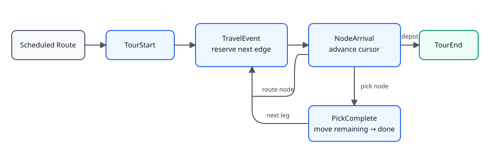
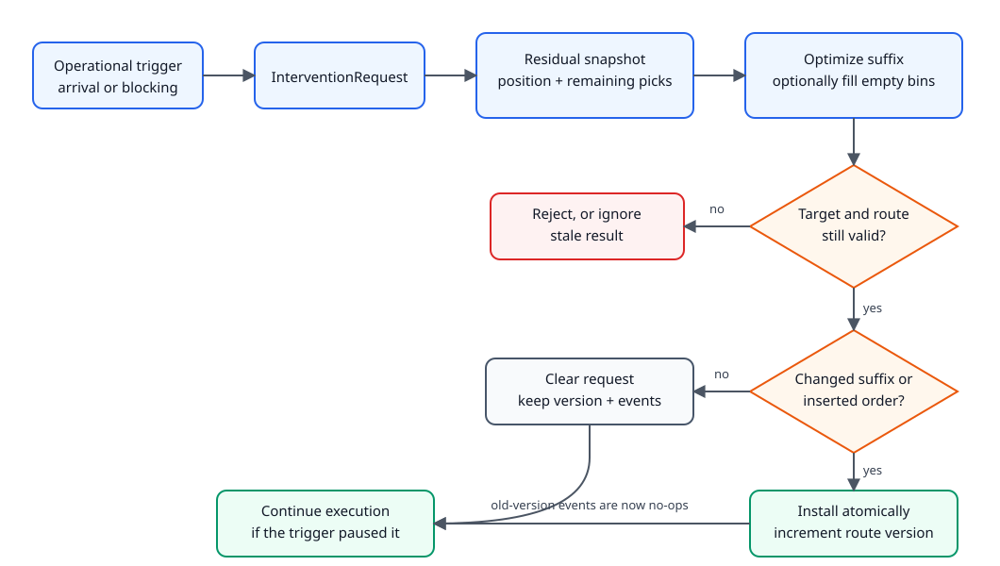

# Tour and routing model

This document describes the current implementation. The key idea is simple:
the solver creates a route, but the simulator executes a versioned **route
suffix**. Reoptimization may replace only that unexecuted suffix; it never
rewrites completed travel or picks.

## The three representations

| Representation | Meaning |
|---|---|
| `Route` | Solver output: batch, item order, annotated nodes, and planned distance. |
| `TourPlanningState` | Mutable execution record for one route: picker, status, cursor, remaining/completed picks, cart bins, and `route_version`. |
| Residual planning snapshot | Temporary optimizer input containing the current position, remaining picks, active batch, buffered orders, and cart state. |

`original_route` is retained for inspection. Execution uses the copied
`annotated_route`, `cursor`, and `remaining_picks` in `TourPlanningState`.
Consequently, `remaining_picks` is the pick identity truth; the annotated
route says how to reach those picks.

## Normal execution (no active reoptimization)



At creation, the cursor is `0`, the executed prefix contains the first node,
and `route_version` is `0`. Each arrival appends the reached node to the
executed prefix and advances the cursor. A pick is atomic: it finishes before
an intervention can change the route. The tour ends only at the configured
depot.

Reoptimization of **unstarted** queued tours (ORSP with
`replanning=unstarted`) is separate. It can cancel and replace eligible
future tours, but it does not alter an active tour's suffix.

## Active suffix reoptimization

An `InterventionRequest` identifies `(picker_id, tour_id, route_version)`.
The adapter verifies this identity and projects exactly one active residual
problem:

- actual current node, or an interpolated point while travelling;
- all remaining picks;
- the active batch, including orders whose picks are already complete;
- cart-bin owners and locks;
- buffered orders and inventory.

The decision result returns through `ActiveRouteReplacement`. Simulation time
does not advance while the routing pipeline runs.



### Where the suffix starts

- **At a node:** the replacement starts at `annotated_route[cursor]`. It is
  compared with the old suffix `annotated_route[cursor:]`.
- **Mid-edge:** the adapter inserts the interpolated picker position as a
  temporary graph origin. The first new leg must reach the old edge's origin
  or destination (only the legal forward endpoint on a directed graph). The
  nodes after that temporary origin are compared with
  `annotated_route[cursor + 1:]`.

If installed, the replacement route becomes the new `annotated_route`, its
origin becomes cursor `0`, and the old movement event is invalidated by the
incremented version. Already travelled mid-edge distance is recorded, and a
first-leg distance override prevents it from being counted again.

## The three active-tour cases

| Case | Trigger | Batch may change? | Commit behavior |
|---|---|---:|---|
| No active reoptimization | None | No | Existing route advances normally; version remains unchanged. |
| Routing-only (`ORP`) | Actual edge/zone/pick-location blocking | No | Returned picks must equal the remaining picks; only their route order/path may change. |
| Routing + insertion (`OBRP`) | An order arrival when an active cart has an empty bin; blocking can also trigger | Additions only | Existing orders/picks remain; buffered orders may be assigned to genuinely empty bins and added to the residual route. |

Insertion currently supports stable, non-mixing `ORDERS` bins with one whole
order per bin. Owned or locked bins cannot be reassigned, every inserted order
must claim one previously empty bin, and inventory must be reservable. A bin
locks on its first confirmed pick and stays owned until depot return.

## Example

Suppose the planned route is:

```text
depot -> A [order 1] -> B [order 2] -> C [order 1] -> depot
```

After picking at `A`, the picker is halfway from `A` to `B`:

```text
immutable prefix: depot -> A -> midpoint
remaining picks:  B/order 2, C/order 1
old suffix:       midpoint -> B -> C -> depot
```

- With no intervention, the already scheduled arrival at `B` continues.
- Routing-only may return `midpoint -> B -> C -> depot` (unchanged, no new
  version) or another valid ordering containing exactly the two remaining
  picks.
- With insertion, order 3 can claim an empty bin and the router might return
  `midpoint -> B -> D [order 3] -> C -> depot`. Installing it also commits
  order 3 and extends the tour's inventory reservation.

## Safety rules enforced at commit

- The expected route version and active picker/tour identity must still match.
- The route starts at the actual position and returns to the depot.
- Existing active orders cannot be removed; routing-only cannot add any.
- The replacement contains exactly the old remaining picks plus inserted
  picks—never completed picks.
- Route, bin, order-buffer, and inventory changes are applied atomically and
  rolled back together on failure.
- Identical suffixes are not installed. This preserves the version and keeps
  already queued operational events valid.

Two flags prevent duplicate work: `replan_requested` records the need, while
`intervention_event_pending` records that a request has been emitted. An
arrival during a pick sets only the former; `PickComplete` emits the request
after the pick. A blocking-triggered request has `resumes_execution=true`, so
even an unchanged result restarts the paused travel/pick chain.

## Audit notes and code map

The traced validation paths consistently protect the executed prefix,
remaining-pick identity, cart ownership, inventory, and stale events. Tests
cover stale-event no-ops, request deduplication and atomic picks, residual
batch construction, exact residual TSP distance, atomic insertion rollback,
and bin locking.

Two narrow robustness gaps remain:

- no focused state-level test asserts changed versus unchanged **mid-edge**
  replacement;
- rollback restores tour, inventory, and order-buffer state, but does not
  explicitly reverse `LayoutManager.replace_token` if a later commit step
  raises. Later steps are currently small and deterministic, but a failure-
  injection test should accompany any change that can make them raise.

### Code map

- State model: `src/casim/domain_objects/tour_model.py`
- Execution and validation: `src/casim/state/tour_manager.py`,
  `src/casim/state/state.py`
- Operational chain: `src/casim/events/operational_events.py`
- Projection: `src/casim/simulation_engine/state_adapter.py`
- Commitment event: `src/casim/events/decision_events.py`
- Focused tests: `tests/test_intervention.py`, `tests/test_cart_inventory.py`
