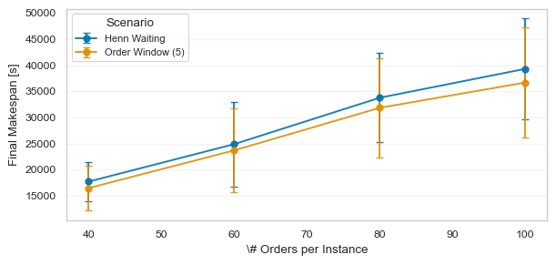

# Henn OOBP Scenarios

This directory contains CASIM configurations for the Henn online order batching problem (OOBP). The scenarios compare two time-window strategies, i.e. two rules for deciding when a picker starts collecting the next batch.

The scenarios can be adjusted in `config/henn_online_config.yaml`.

## Scenarios

### 1. Variable time window based on queued orders

`scenario_henn_order_window_waiting` implements a simple form of waiting strategy, namely variable time-window strategy based on a minimum number of orders in the queue (`VTW_QO`). 
For this experiment we fixed the order threshold to 5. An more in-depth overview of other waiting strategies can be found in [3].

The solver is called only when both conditions are true:

```yaml
conditions:
  - _target_: casim.simulation_engine.conditions.NbrPickersCondition
    threshold: 1
  - _target_: casim.simulation_engine.conditions.NbrOrdersCondition
    threshold: 5
```

This means that at least one picker must be available and at least five open orders must be buffered.
A commitment policy only selects how much of the returned solution is released. If more than one batch is sequenced, we only return the to the picker while the rest stays in the order pool. 
This is implemented with the SchedulingCommitmentPolicy.
```yaml
commitment_policy:
  _target_: casim.decision_engine.decision_engine.SchedulingCommitmentPolicy
  n_jobs: 1
```

### 2. Henn time-window strategy

`scenario_henn_waiting` implements the reactive time-window strategy from Henn’s online batching algorithm (`VTW_HE`). 

The solver is called when both conditions are true:

```yaml
conditions:
  - _target_: casim.simulation_engine.conditions.NbrPickersCondition
    threshold: 1
  - _target_: casim.simulation_engine.conditions.NbrOrdersCondition
    threshold: 1
```

This means that at least one picker must be available and at least one open order must be buffered.

The time-window strategy is represented by the commitment policy:

```yaml
commitment_policy:
  _target_: casim.decision_engine.decision_engine.HennWaiting
  n_jobs: 1
```

If several candidate jobs are returned, the first job according to the sequencing rule is released. If only one candidate job is returned, `VTW_HE` may postpone its start time using Henn’s release-time rule.

## State adapters

The two scenarios use different state adapters because they expose different order sets to the solver.

### `OrderWindowAdapter`

For `VTW_QO` we use the `OrderWindowAdapter` which exposes only the current order buffer. 
Orders remain buffered until the order threshold is reached. 
Once a job is committed, the committed orders are removed from the buffer and added to the planning state.

### `HennWaitingAdapter`

`HennWaitingAdapter` exposes the current order buffer plus orders from tours that have been planned but have not yet started.

This is needed for `VTW_HE`. 
If a single candidate job is postponed and a new order arrives before its postponed start time, the previously planned orders must be considered again.
Otherwise, the postponed job would be fixed too early and could not be re-batched.

The adapter therefore constructs the solver input from:

* newly buffered orders, and
* orders assigned to unstarted tours with status `SCHEDULED`, `PENDING`, or `ASSIGNED`.

## CoSy repository

The baseline Henn repository uses the following components:

```yaml
components:
  - casim.pipelines.problem_based_template.InstanceLoader
  - casim.pipelines.subproblems.item_assingment.GreedyIA
  - casim.pipelines.subproblems.batching.FiFo
  - casim.pipelines.subproblems.picker_routing.SShapeHenn
  - casim.pipelines.subproblems.sequencing.SPTSequencing
  - casim.pipelines.problem_based_template.ResultAggregationSequencing
```

`SShapeHenn` implements the Henn-specific routing component. Besides routing each candidate batch, it computes the service-time values required by the Henn time-window strategy:

* `st_j`: service time of the candidate batch
* `st_i`: service time of an order if picked alone

Both values include setup time, travel time, and picking time. They are stored on the corresponding `PickList` and used by the `HennWaiting` commitment policy.

## Timing convention

The implementation uses the following timing convention:

* `Job.release_time`: time at which the job becomes available
* `Job.start_time`: time at which the batch is assigned and setup begins
* `TourStart`: event at `Job.start_time`
* first travel event: after setup time
* `Job.end_time`: `Job.start_time + setup time + travel time + picking time`

This follows the OOBP definition where service time consists of setup time, routing time, and picking time.

## Experiments

We provide a sweep over multiple instances and compare the two time-window strategies. The complete experiment results are stored in `outputs/multirun`.

The figure below shows the final makespan across instances.



*Figure 1: Final makespan across instances under the two time-window strategies.*

## Data sources

The warehouse instances are taken from Heßler and Irnich [1], available [here](https://logistik.bwl.uni-mainz.de/research/#benchmarks).

Order arrival times are taken from the OOBP benchmark of Henn [2], available [here](https://grafo.etsii.urjc.es/optsicom/oobp).

## References

[1] K. Heßler and S. Irnich (2022). *Modeling and Exact Solution of Picker Routing and Order Batching Problems.* LM-2022-03, Chair of Logistics Management, Johannes Gutenberg University, Mainz, Germany.

[2] S. Henn (2012). *Algorithms for on-line order batching in an order picking warehouse.* Computers & Operations Research, 39(11), 2549–2563.

[3] S. Gil-Borrás, E. G. Pardo, E. Jiménez, and K. Sörensen (2024). *The time-window strategy in the online order batching problem.* International Journal of Production Research, 62(12), 4446–4469.
